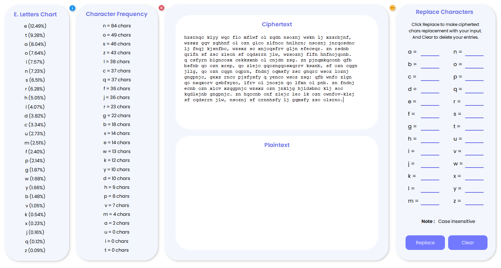

  

<h1 align="center"> Letter Frequency Attack </h1>

  
  
  

## Description
>Write a program that can perform a letter frequency attack on any monoalphabetic substitution cipher without human intervention. Your software
should produce possible plaintexts in rough order of likelihood. It would
be good if your user interface allowed the user to specify “give me the top
10 possible plaintexts.

But no, this program needs human intervention. You can input your thought and decrypt the ciphertext, all as you want.

## Preview

## Information 🏷
- __Language:__ _C++_
- __UI Framework:__ _Qt 6_ 
- __Operating System:__ _Kali Linux 2021.1_

## Find me around the web 🌎

- _Information in public on_ <a href="https://meokisama.github.io/">Blog</a> ✍🏾
- _Sharing updates on_ <a href="https://facebook.com/slytherinnn/">Facebook</a> 💼
- _Other products on_ <a href="https://www.behance.net/meokisama">Behance</a> 🏓
- _Daily photos on_ <a href="https://www.instagram.com/hi.im.meoki/">Instagram</a> 📷
- _"__Wibu__" collection on_ <a href="https://www.flickr.com/photos/meokisama/albums">Flickr</a> 👾
